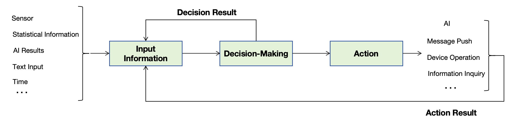
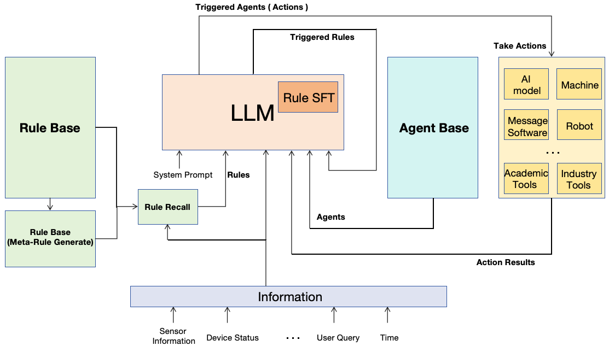

# LogicChain : Expert System based on LLM

## Introduction

- LogicChain uses an LLM (Large Language Model) as the rule reasoning engine of expert system, makes decisions based on rule logic and input information ，and takes actions.

- The input information is unrestricted and can include sensor status data, statistical information, AI detection results, user input text, clock information, and so on. Rule logic refers to text commands similar to "If ..., Then ..." and a large number of rules form a rule knowledge base, also known as expert knowledge in the field of expert systems. The actions to be executed by the decisions are also unrestricted and can include AI capabilities, message pushing, device operations, information inquiries, etc. In the current context of the LLM field, these actions are also referred to as Agents.

- The decision result itself is also fed back into the input information, cyclically triggering rules until the LLM believes that no rules can be triggered, which we call the 'decision chain' or inner loop; the result of the action taken after the decision is also fed back into the input information, cyclically triggering rules to execute actions, which we call the 'decision-action chain' or outer loop.



## Architecture

PROCESS：

- Original input information, Rules to be judged, and system prompts are input into the LLM to obtain the initial triggered rule command.
  
- The initial triggered rule command and Original input information, Rules to be judged, and system prompts are input into the LLM to trigger the new rule command.

- All historically triggered rule commands (include original input information), Rules to be judged and system prompts are input into the LLM to trigger the new rule command; Trigger rules in a chain loop in this manner until the LLM outputs 'No Rule triggered'.

- All rules have been triggered; input all historically triggered rule commands, Rules to be judged, system prompts, and Agents (json description) to be judged into the LLM to decide which agent to be executed."

- Execute all actions based on the triggered Agents.

- Action results (as the original input information), Rules to be judged, and system prompts are input into the LLM to trigger rule command; Trigger Actions in a chain loop until the LLM outputs 'No Action Triggered'



## What Could LogicChain do

- LogicChain is inspired by the traditional real-time expert system GenSym G2 and aims to align its functionalities with G2. It is designed for use in areas such as decision support, intelligent monitoring, process control, and fault diagnosis. LogicChain can be closely integrated with various external systems, often referred to as Agents, including enterprise application systems, databases, control systems, network systems, and telemetry systems, to help users enhance the effectiveness and performance of their operations.

## How To Use LogicChain

- <span>1</span>. Gunicorn Start 5 module service : ctrl, llm_infer, rule, agent and act; 

  ```Shell
  gunicorn moonshot_llm_infer:app -w 1 -t 5000 -b 127.0.0.1:5000
  gunicorn rule:app -w 1 -t 5000 -b 127.0.0.1:5001
  gunicorn agent:app -w 1 -t 5000 -b 127.0.0.1:5002
  gunicorn act:app -w 1 -t 5000 -b 127.0.0.1:5003
  gunicorn ctrl:app -w 1 -t 5000 -b 127.0.0.1:5004
  ```

- <span>2</span>. Rule Setting : post rule service

  - Add one rule
  ```python
    post_data = {
        'type' : 'add',
        'rule' : '如果现在时间是上午7点30到8点之间, 则获取杭州今天的天气；', # 'If Then' rule
    }
  ```

  - Update one rule
  ```python
  post_data = {
    'type' : 'update',
    'rule_id' : 2, # the line number of rule to update, from 1 start
    'rule' : '如果现在时间是上午7点30到8点之间, 则获取杭州今天的天气；', # 'If Then' rule
  }
  ```

  - Delete one rule
  ```python
  post_data = {
    'type' : 'delete',
    'rule_id' : 2, # the line number of rule to delete, from 1 start
  }
  ```

  - Delete all rules
  ```python
  post_data = {
    'type' : 'delete_all',
  }
  ```

  - Get all rules : will add rule_prefix in front of every rule
  ```python
  post_data = {
    'type' : 'get_all_rules',
  }
  ```

- <span>3</span>. Agent Setting : post agent service

  - Add one agent
  ```python
    post_data = {
        'type' : 'add',
        'agent' : '{ 触发本动作的规则动作指令: 这里填写触发本动作的规则动作指令原文, 动作: 获取以前天气能力 , 执行脚本:  get_weather,  方法: get_weather, 输入参数: 地名, 距离当前时刻, 说明: 要获取的以前时刻要换算为距离当前时刻多少天前的格式， '距离当前时刻'键值内容严格按照'-xx天'格式，举例'-00天', 昨天是'-01天', 前两天是'-02天'};', # json type agent description
    }
  ```

  - Update one agent
  ```python
  post_data = {
    'type' : 'update',
    'agent_id' : 2, # the line number of agent to update, from 1 start
    'agent' : '{ 触发本动作的规则动作指令: 这里填写触发本动作的规则动作指令原文, 动作: 获取以前天气能力 , 执行脚本:  get_weather,  方法: get_weather, 输入参数: 地名, 距离当前时刻, 说明: 要获取的以前时刻要换算为距离当前时刻多少天前的格式， '距离当前时刻'键值内容严格按照'-xx天'格式，举例'-00天', 昨天是'-01天', 前两天是'-02天'};', # json type agent description
  }
  ```

  - Delete one agent
  ```python
  post_data = {
    'type' : 'delete',
    'agent_id' : 2, # the line number of agent to delete, from 1 start
  }
  ```

  - Delete all agents
  ```python
  post_data = {
    'type' : 'delete_all',
  }
  ```

  - Get all agents : will add agent_prefix in front of every agent
  ```python
  post_data = {
    'type' : 'get_all_agents',
  }
  ```

- <span>4</span>. send input information to LogicChain : post ctrl service
  ```python
  json_data = {
    'text_info' : '现在时间是 2024-05-05 07:46', # input information
  }
  ```

## To Do
  - Chat LLM Support
    
    - ✅ moonshot-v1-128k (kimi chat)
      
      - ✅ chinese
        
      - [ ] english
    
    - [ ] chatgpt
   
  - [ ] Rule SFT for Chat LLM
      
  - [ ] Rule Simulator

  - [ ] Rule Conflict Detect

  - [ ] Massive Rule Inference
